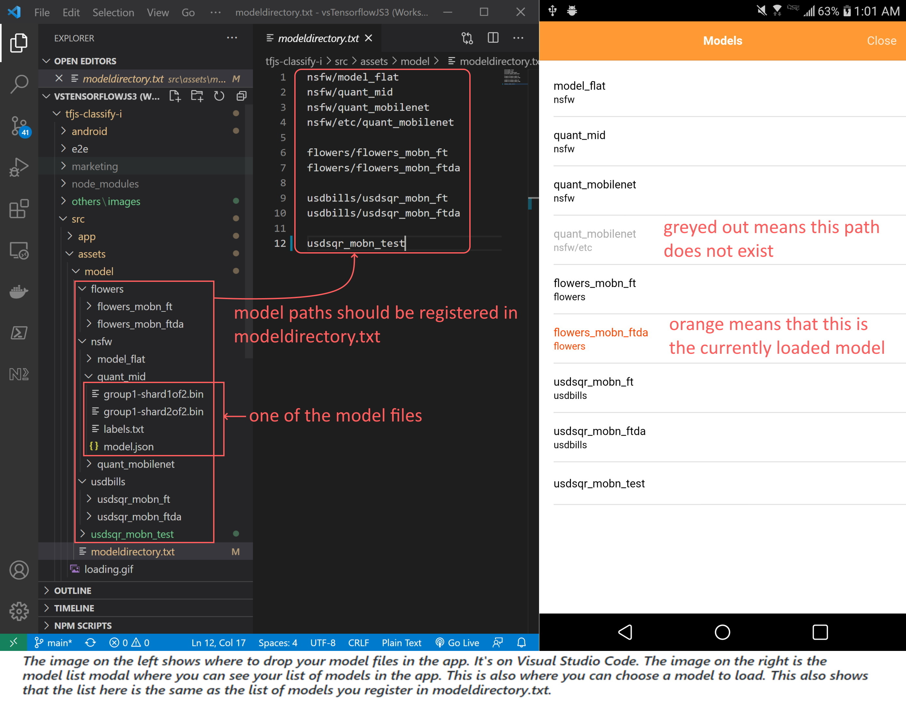
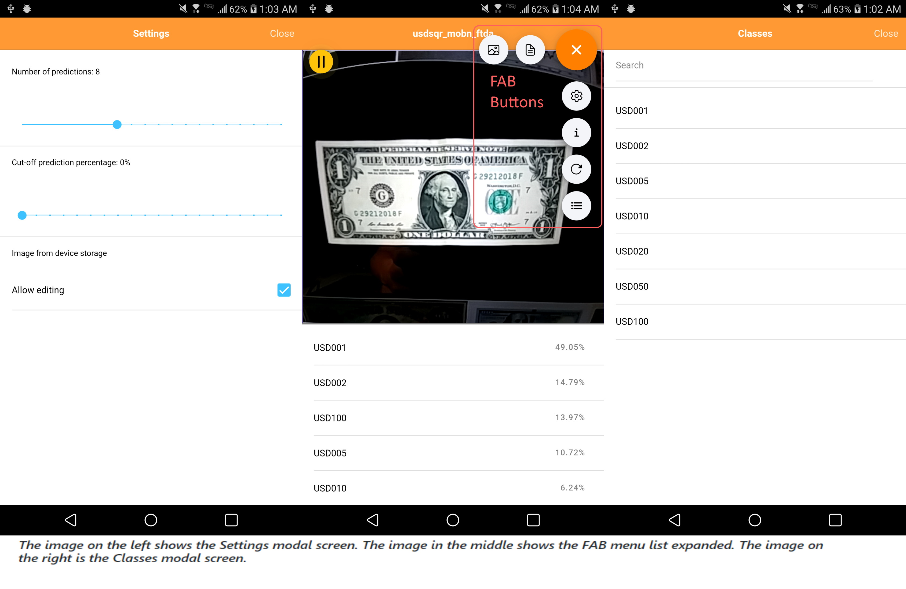

 
 

## How to copy your model files into the app
1) Place your model files (binary weight, model.json, and labels.txt) in its own folder and drop it in `src/assets/model/<optional folders>/`. So the path for your model will look like this `src/assets/model/<optional folder>/<optional subfolders>/<main model folder>/<content-model files>`.
2) You can drop as many models as you want.
3) Register your model paths in modeldirectory.txt.
>This app has sample loaded models so it is easy for you to follow.

## How to run this project in the browser
 You can run *ng serve* or *npm start* to run the app on the browser.
## How to run this project on device
This project uses capacitor as its wrapper and mini web hosting server to creating native app, and its bridge to integrating to native API SDK such as the Camera and File Manager for accessing your photos. 

Once you've cloned or downloaded this project you may also build it in iOS if you prefer that platform. I build this app using Windows so I can only create android folder.

You can run on the terminal window *npm run build* and some of the capacitor cli commands such as *ionic capacitor add ios/android*, *ionic capacitor sync ios/android*, *ionic capacitor open ios/android*, and/or *ionic capacitor run ios/android*.

*npm run build* will create the www folder that will contain the transpiled javascripts, css, and index.html files. This is important because this will be the web app that will be wrapped by capacitor to be used as a native app in iOS or Android device. Do this before building your Android project.

Or you can just do *npm run build-android*. Collectively, I made a combined script on package.json that will do *npm run build* and *ionic capacitor sync android* thereafter. That will do the trick for your Android project. 

### Explanation of Ionic Capacitor CLI commands 
*ionic capacitor add ios* or *ionic capacitor add android* will build and add the ios or android folder. That is basically the app that you can run on XCode or Android Studio respectively. You only need to run this once. Successive updates on the code doesn't need to re-run this command.

*ionic capacitor sync ios* or *ionic capacitor sync android* will sync any changes you've made on the app only after you've run again *npm run build* to update the www folder.

*ionic capacitor open ios* or *ionic capacitor open android* will just open the app on XCode or Android Studio respectively. You may have to try it multiple times because, sometimes, it doesn't work on the first tries. Alternatively, you can just open Android Studio or XCode and directly open the project created on the android and ios folders respectively.

*ionic capacitor run ios* or *ionic capacitor run android* will just run all of capacitor cli commands mentioned above. So you can just solely use this one on any creation or update of ios and android folders.

.
## How to use the app
1) On the first time running this app on your device, it will not load any model and your camera view is off. First, you need to open the model list modal and choose your model to load.
2) Upon loading the model, the app will ask various permissions at the time of opening the camera view (or webcam if you are using a desktop browser) or getting photos from your phone storage (or hard disk if you are using a desktop browser ). Please allow to do so.
3) Initially, the camera view is streaming and the prediction list will appear at the bottom of the screen. If you want a still image from the camera view, just tap the screen and it will pause. Tap it again and it will resume streaming.

 
4) You can infer photo from the device storage by clicking on image icon FAB (floating action button). Once photo is loaded and predictions listed, you can go back to camera view by tapping the screen.

.
### What are the options in the Settings modal
1) **Number of predictions** - Ranges from 1 to 20. This will limit the number of prediction list items. If you set this setting higher than the number of classes, of course, the maximum number of prediction items will be the number of classes.
2) **Cut-off prediction percentage** - Ranges from 0% to 95%. This will only show prediction items with percentage higher or equal to this setting. This avoids to list insignificant classes/predictions.
3) **Allow editing** - If you try to open and get image from the device storage and this setting is `checked`, it will proceed to image editor prior to loading the image into the screen.
### Guide to menu options on FAB(Floating Action Button) list

 This will display the Settings modal screen. 

 This will display the About modal screen.

 This will refresh or restart the whole app. 

 This will display the Models modal screen where you can load a new model for the app, or view the classes or get the info of any models in the list.

 This will display the Classes modal screen. It will show the list of classes for the currently loaded model.

 This will allow you get and load a photo from the device storage.

.
 
.

.
## Description of the app
This is a mobile app made from Ionic that can test out TFJS model files without modifying anything on the code. Just copy the model files on a particular path (src/assets/model), run and build it, create the Android (or iOS) project, and run it on Android studio (or XCode) and you will be able to test it out on your mobile device.

Ionic is a mobile development technology that can maintain one codebase for a project that is applicable on both Android and iOS. Ionic is so chosen because this is basically a web app that is wrapped and hosted with a native app called Cordova or Capacitor. This app uses Capacitor as its native app wrapper/container. TFJS is very much compatible with this technology because it is made for Javascript coding. Ionic, being made to run on a mobile device, would take the advantage of using the device camera to test out the model for object classification. The app has even the functionality to pick out an image or photo from the device storage. Traditionally, TFJS is run on a desktop device for testing still images or video coming out from the web cam. But this mobile app will make it easier to proceed on testing graph or keras models conveniently with a portable device that you can carry within your pocket. 

Model files for Tensorflow JS are also known as web-format model files. It comprises of  model.json and the binary weight files(group1-shard1of2.bin, group1-shard1of3.bin...). Binary weight files are the splits of one big file so that each of it can only have, at most, 4MB that is suitable for browser caching. I made a simple [script](https://colab.research.google.com/drive/1UYS98ACTwM3a2sHQLQlO8IHOBMTFFYmp) on Google Colab to make these files. You can read the blog about it [here](https://robhizon26.medium.com/tfjs-model-maker-using-google-colab-and-google-drive-4406cba52436). It will generate the model files plus a labels.txt on your Google Drive. The labels.txt is just the list of classes for the model, ie. for `flowers` model it will have daisy, dandelion, roses, tulips, and sunflowers as its classes.  Please note that if you generate your model files with a different approach than mine, add labels.txt to it. You need to copy the model.json, the binary weight files, and labels.txt to the path on this app before running it. 

Traditionally, when you want to test a new TFJS model, you would also be required to add the classes in the Javascript code programatically. Even for programmers this would be a hassle because every base program differs depending on how the original coder wrote the code. You would have to trace the source code where to put it(referring to the classes) and how to code it. This app would make it sure that any person, even non-programmers, would be able to dump these files on the codebase without any worry on how it is running or how it is converting the labels.txt to classes.

Inference is simply the act of taking some image input and running it through the machine learning model (essentially a lot of mathematical operations), and then providing some results. Image input will always be a still image from a photo or video frame obtained from the camera stream. With TFJS models we return the predictions in the form of a JSON object so it is easy to use.

The camera view used on this app is not directly from native camera of the device but from the video that is fed to the HTMLVideoElement from the native camera. 

The app name 'TFJS Classify I' means TFJS-Tensorflow JS(Javascript); Classify-Image Classifiction, which is a type of deep learning application on AI; I-Ionic.
.
## Other related links
If you want TFJS image classification model maker, please check [this out](https://robhizon26.medium.com/tfjs-model-maker-using-google-colab-and-google-drive-4406cba52436). This will create binary weight(group1-shard1of2.bin, group1-shard1of3.bin…), model.json, and labels.txt files. This runs on Google Colab and Google Drive will be used to drop your compressed image dataset and also to output your final model files. 
