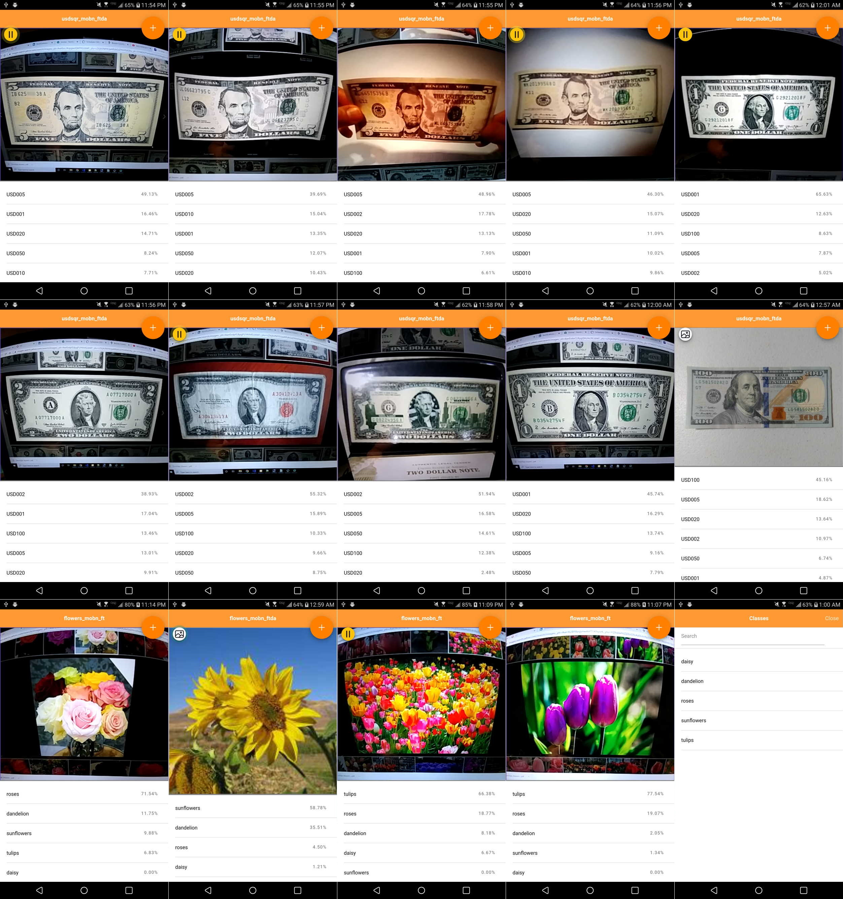
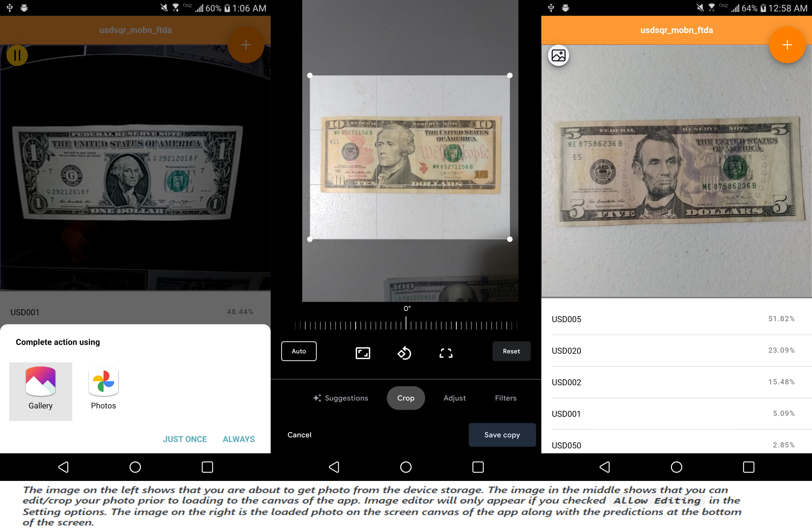

 
 
 

## How to copy your model files into the app
1) Place your model files (binary weight, model.json, and labels.txt) in its own folder and drop it in `src/assets/model/<optional folders>/`. So the path for your model will look like this `src/assets/model/<optional folder>/<optional subfolders>/<main model folder>/<content-model files>`.
2) You can drop as many models as you want.
3) Register your model paths in modeldirectory.txt.
>This app has sample loaded models so it is easy for you to follow.

.

##### *The image on the left shows where to drop your model files in the app. It's on Visual Studio Code. The image on the right is the model list modal where you can see your list of models in the app. This is also where you can choose a model to load. This also shows that the list here is the same as the list of models you register in modeldirectory.txt.* 
.
## How to run this project in the browser
 You can run *ng serve* or *npm start* to run the app on the browser.
## How to run this project on device
This project uses capacitor as its wrapper and mini web hosting server to creating native app, and its bridge to integrating to native API SDK such as the Camera and File Manager for accessing your photos. 

Once you've cloned or downloaded this project you may also build it in iOS if you prefer that platform. I build this app using Windows so I can only create android folder.

You can run on the terminal window *npm run build* and some of the capacitor cli commands such as *ionic capacitor add ios/android*, *ionic capacitor sync ios/android*, *ionic capacitor open ios/android*, and/or *ionic capacitor run ios/android*.

*npm run build* will create the www folder that will contain the transpiled javascripts, css, and index.html files. This is important because this will be the web app that will be wrapped by capacitor to be used as a native app in iOS or Android device.

*ionic capacitor add ios* or *ionic capacitor add android* will build and add the ios or android folder. That is basically the app that you can run on XCode or Android Studio respectively. You only need to run this once. Successive updates on the code doesn't need to re-run this command.

*ionic capacitor sync ios* or *ionic capacitor sync android* will sync any changes you've made on the app  only after you've run again *npm run build* to update the www folder.

*ionic capacitor open ios* or *ionic capacitor open android* will just open the app on XCode or Android Studio respectively. You may have to try it multiple times because, sometimes, it doesn't work on the first tries. Alternatively, you can just open Android Studio or XCode and directly open the project created on the android and ios folders respectively.

*ionic capacitor run ios* or *ionic capacitor run android* will just run all of capacitor cli commands mentioned above. So you can just solely use this one on any creation or update of ios and android folders.

## How to use the app
1) On the first time running this app on your device, it will not load any model and your camera view is off. First, you need to open the model list modal and choose your model to load.
2) Upon loading the model, the app will ask various permissions at the time of opening the camera view (or webcam if you are using a desktop browser) or getting photos from your phone storage (or hard disk if you are using a desktop browser ). Please allow to do so.
3) Initially, the camera view is streaming and the prediction list will appear at the bottom of the screen. If you want a still image from the camera view, just tap the screen and it will pause. Tap it again and it will resume streaming.

 
4) You can infer photo from the device storage by clicking on image icon FAB (floating action button). Once photo is loaded and predictions listed, you can go back to camera view by tapping the screen.

##### *The image on the left shows that you are about to get photo from the device storage. The image in the middle shows that you can edit/crop your photo prior to loading to the canvas of the app. Image editor will only appear if you checked `Allow Editing` in the Setting options. The image on the right is the loaded photo on the screen canvas of the app along with the predictions at the bottom of the screen.* 
.
### What are the options in the Settings modal
1) **Number of predictions** - Ranges from 1 to 20. This will limit the number of prediction list items. If you set this setting higher than the number of classes, of course, the maximum number of prediction items will be the number of classes.
2) **Cut-off prediction percentage** - Ranges from 0% to 95%. This will only show prediction items with percentage higher or equal to this setting. This avoids to list insignificant classes/predictions.
3) **Allow editing** - If you try to open and get image from the device storage and this setting is `checked`, it will proceed to image editor prior to loading the image into the screen.
### Guide to menu options on FAB(Floating Action Button) list

 This will display the Settings modal screen. 

 This will display the About modal screen.

 This will refresh or restart the whole app. 

 This will display the Models modal screen where you can load a new model for the app, or view the classes or get the info of any models in the list.

 This will display the Classes modal screen. It will show the list of classes for the currently loaded model.

 This will allow you get and load a photo from the device storage.

.

##### *The image on the left shows the Settings modal screen. The image in the middle shows the FAB menu list expanded. The image on the right is the Classes modal screen.*
.

##### *The image on the left shows you the options when you tap a model on the list. You can either load a new model for the app, get its info, or view its classes. The image in the middle shows you a dialog of the model info when you choose that optoin from the bottomsheet. The image on the right shows you the currently loaded model info from the About modal screen. It also shows the HTMLVideoElement dimension that is detected from the capacitor wrapper browser that basically relies on the device screen dimension.*
.
 

## Other related links
If you want TFJS image classification model maker, please check [this out](https://robhizon26.medium.com/tfjs-model-maker-using-google-colab-and-google-drive-4406cba52436). This will create binary weight(group1-shard1of2.bin, group1-shard1of3.bin…), model.json, and labels.txt files.
